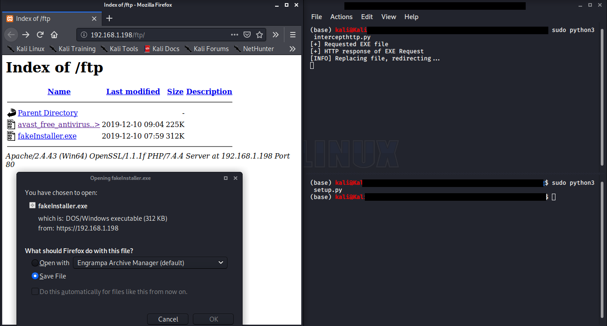

# Hijack Downloads
Hijack downloads on your network after being the man-in-the-middle. Use ARP spoofing to become the MITM. 
## Getting Started
Download the repository. Change the location in intercepthttp.py and run setup.py. Run flush.py once done.
> Python == 3.7
>
> Scapy == 2.4.3
>
> NetfilterQueue == 0.8.1
>
## Details
| File | Information |
|-------|------------|
| flush.py  | flush iptables  | 
| intercepthttp.py  | intercept EXE downloads on the network | 
| output.png  | output of the program | 
| setup.py  | setup iptables | 
| venv  | python environment | 

## Output
